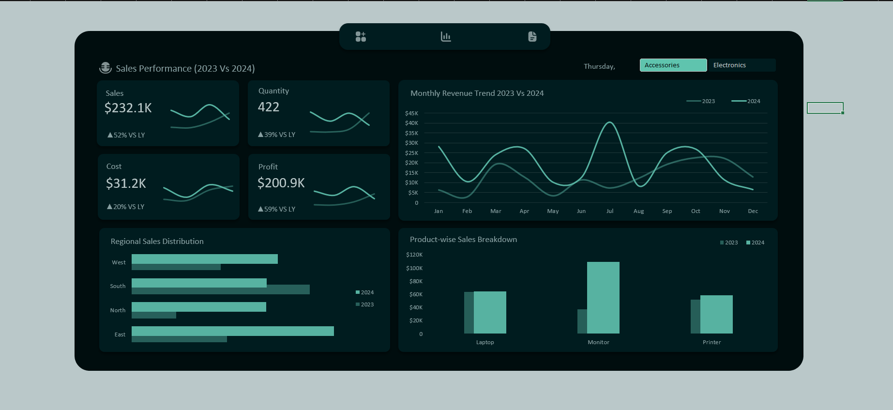

# 📊 Sales Performance Dashboard (Excel)

## Overview
This project is a **dynamic Excel dashboard** built using **Pivot Tables, Pivot Charts, and Excel functions** to analyze sales performance across regions, products, and time periods.  
It provides a **Year-over-Year (YoY) comparison** between 2023 and 2024 with interactive navigation for deeper insights.


## 🔑 Features
- 📈 **Sales Performance KPIs**: Sales, Quantity, Cost, and Profit with YoY % growth.  
- 📊 **Monthly Revenue Trend**: 2023 vs 2024 revenue visualized over time.  
- 🌍 **Regional Sales Distribution**: Sales comparison across West, South, North, and East.  
- 🎧 **Product-wise Breakdown**: Sales performance for Headphones, Keyboards, and Mouse.  
- 🔄 **Dynamic Filters**: Easily switch between product categories (Accessories, Electronics).  
- 📌 **Linked Dashboard Elements**: Clickable navigation for smooth user experience.  

## ⚙️ Tools & Techniques
- Microsoft Excel  
- Pivot Tables & Pivot Charts  
- Excel Formulas for **YoY Growth Calculations**  
- Dashboard Formatting & Layout Design  

## 📂 Files in Repository
- `Sales_Dashboard.xlsx` → Interactive Excel dashboard  
- `Sales Dashboard.PNG` → Screenshot preview of the dashboard  

## 🔮 Future Improvements
- Planned enhancements for this dashboard include:
- Adding more product categories and sub-categories.
- Automating data refresh using Power Query.
- Expanding KPIs (e.g., Customer Acquisition, Retention).
- Adding trendline forecasts for revenue and profit.
- Publishing a Power BI version for richer interactivity.

## 🚀 How to Use
1. Download or clone this repository:
   ```bash
   git clone https://github.com/MichelleWarari/Analytics-Sales-Performance.git
